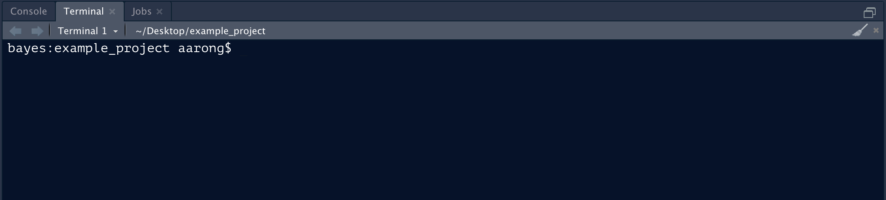
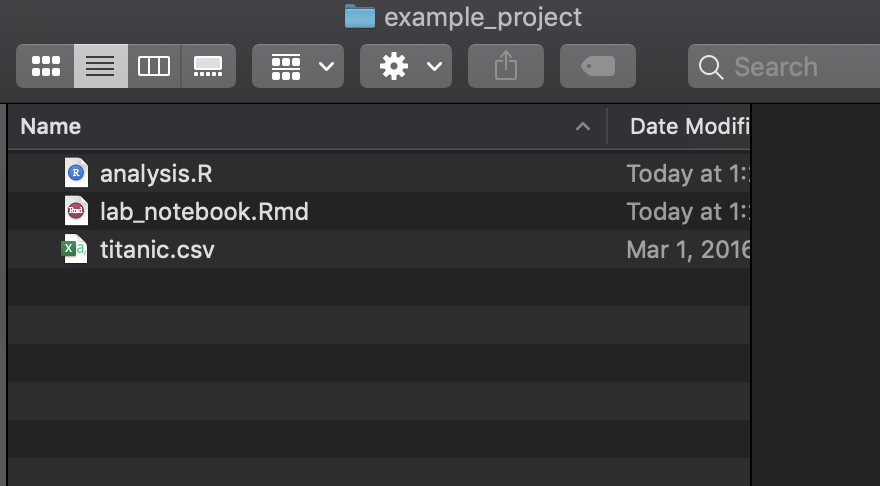
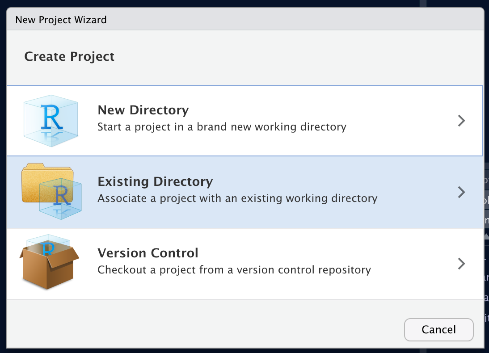
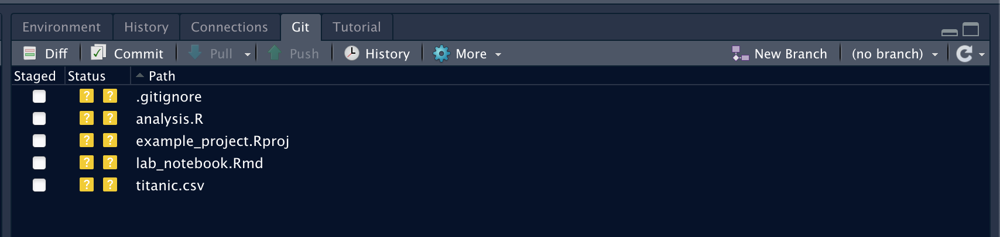
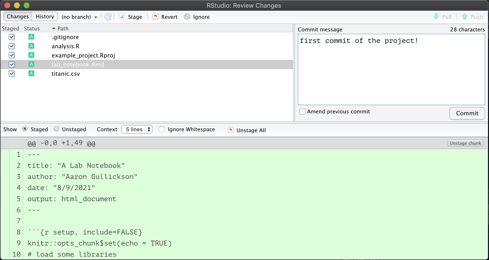
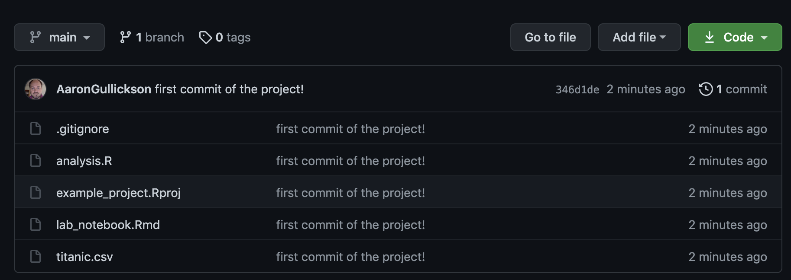
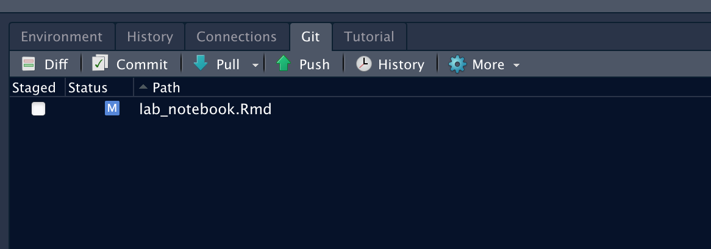
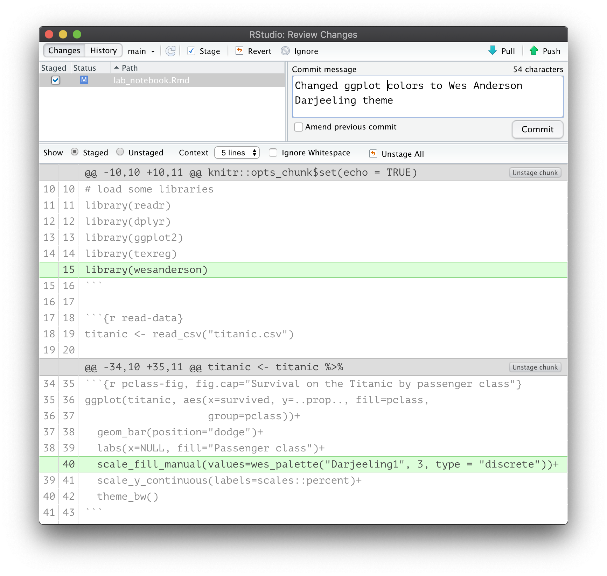

Increasingly, academic scholars, data scientists, and quantitative researcher are turning to [GitHub](https://github.com/) for collaboration and to share data, code, and results. GitHub allows people to host public and private "repositories" that allow for the easy communication of research procedures and results. Underlying the GitHub architecture is the version control system, [git](https://git-scm.com/), which provides further benefits to researchers.

## Why should you use git/GitHub?

[Version control systems](https://www.atlassian.com/git/tutorials/what-is-version-control) like git have long been used by programmers to sanely collaborate and organize software projects and they can serve the same purpose for quantitative researchers who spend much of their time coding. If you have never used version control systems, then the process can seem arcane and the benefits unclear. Once you start using a version control system, however, it becomes difficult to see how you ever got by before. What are some of the benefits of this approach? 

First and probably foremost, git will allow you to **collaborate sanely**. Users make changes to code ("commits") and then "push" them to a centrally shared repository (located at GitHub, for example). Other users can clone this repository and then easily "push their own changes as well as "pull" in other changes, allowing everyone to easily stay in-sync. Complex coding projects can also be "branched" and then later merged back into the main code base to avoid conflicts between users.


Second, by using version control systems, you effortlessly create your own **research log**. All changes to your code base are committed to the repository with a brief description of your changes. Collectively these commits serve as a research log of your work. You no longer have to remember when exactly you added that one variable to the model. The changes are right there in your history log. 

Third, you can **stop fearing change**. Have you been in the situation where you know your code kind of works, but maybe its not the best? People often do one of two things in this situation. You might just leave it alone, because why mess with a piece of code that seems to work? Are you trying to anger the coding gods? Alternatively, you might decide to fix it, but fearful that you might make it worse, you duplicate the file (with a name like "analysis_just_trying_a_thing_v2.R"). Neither of these approaches is great. If you use version control, you can make radical changes to your code without fear. Did you mess it up? No worries, just revert back to the last "commit" and try again. To draw out an [analogy from Hadley Wickham](https://r-pkgs.org/git.html#git-commit), the "free-climbing" approach to coding is dangerous and scary. Git is there to catch you when you fall.

Fourth, you can finally **keep your project tidy.** The tendency I note above to simply duplicate files with slightly different names ("paper-v2.1_06272017_FINAL_REALLY_THIS_TIME.docx") is its own form of very inefficient version control. Over time, the directory containing your project becomes littered with files, and the ability to understand this chaos is locked deep somewhere in your own brain alone. If you practice this form of *horizontal* versioning, then help is on the way! Proper version control systems, like git, use "vertical" versioning. Because all of your changes are tracked on any given file, there is no need to duplicate a bewildering array of slightly different versions of the same file. Because you no longer need to fear change, you can keep your project tidy and compact. You only need one script to organize and clean your data. You only need one file to write the paper. Your project will suddenly become easier to navigate for yourself and everyone else. 

## Your First GitHub Repository

Have I piqued your interest? Lets talk about how to set up a git repository using RStudio and link it to an online repository on GitHub. The instructions here assume that you have some directory with R code in it that you want to turn into a repository on GitHub. You will also need to create an account on GitHub. I also will assume you are using RStudio to run R which provides a nice user interface for working with git.

Git itself is a command line interface. You can work with it from inside RStudio using a GUI interface but to get it set up properly, you will need to be able to work on the command line in the working directory of your project. The easiest way to use the command line in RStudio is to use the "Terminal" tab right next to the console tab in the lower left panel. You should see something like:



If you are on a Windows system, you will want a UNIX style command line. When you install git (as described below), you will gain access to a UNIX style terminal with an application called [Git Bash](https://www.atlassian.com/git/tutorials/git-bash). You can set git bash to be your default terminal in the RStudio preferences. 

One thing to keep in mind is that GitHub has a single file size limit of 100 mb. If you have a single file in your directory that is larger than 100 mb, then GitHub will not allow you to push that file up to your GitHub repository. This issue most frequently arises with large datasets. Sometimes this can be fixed by compressing the file, since R can read directly from compressed files. Another solution is to host the large file somewhere else (e.g. DropBox). 

### Step Zero: Install and configure git

To get started you will need to install git on your local system. Git is extremely lightweight and easy to install and is available on all major operating systems. You can download and install the version for your operating system [here](https://git-scm.com/downloads).

Once you install git, you will want to set up a couple of initial parameters before you get started. The easiest way to set up git is the [`usethis`](https://usethis.r-lib.org/) R package, which includes several functions for working with git. Most importantly, you need to set up a user name and email that will be shown for all commits. You can do this with the following code:

```r
library(usethis)
use_git_config(user.name = "Jane Doe", user.email = "jane@example.com")
git_vaccinate()
```

When you perform git operations on your GitHub repository, you will need to authenticate with GitHub. As I write this, you can do this by entering your GitHub user name and password. However, this functionality [will soon be going away](https://github.blog/2020-12-15-token-authentication-requirements-for-git-operations/) and you will be required to have a personal access token (PAT) to authenticate with GitHub.  Luckily, [you can easily set up a PAT](https://usethis.r-lib.org/articles/articles/git-credentials.html) through the `usethis` package as well. First, you can use the `create_github_token()` command in R which will direct you to a GitHub page that will generate a PAT for your use:

```r
create_github_token()
```

You can also go to [this page](https://docs.github.com/en/github/authenticating-to-github/keeping-your-account-and-data-secure/creating-a-personal-access-token#creating-a-token) for instructions on generating a PAT.

Once you have a PAT, copy it and enter the following into R:

```r
gitcreds::gitcreds_set()
```

This will then guide you through the process of setting your PAT. Once this PAT is set up, pushing and pulling to GitHub should work seamlessly.

To check that everything seems to be working you can always use the `git_sitrep()` command in the `usethis` package.

```r
usethis::git_sitrep()
```

### Step One: Turn your code into an R project and git repository

Now that git is set up, you can turn that directory of code into a proper git repository. To accomplish this, you will first need to turn your directory into an R project. 

As an example, I have set up a simple directory that I want to convert into a git repository, pictured below:



This repository just has some data in CSV format, an R script with some code and an R Markdown file that I am using as a lab notebook. 

Although this may be a "project" in my head, it is not yet an *R project*. If I turn this directory into an R project, RStudio will add an *.Rproj file with some additional information. R projects are useful in [their own right](https://support.rstudio.com/hc/en-us/articles/200526207-Using-Projects), but the real advantage here is that I can use the built-in git features of RStudio on an R project. 

To turn this into an R project, you will go to File > New Project which will bring up a dialog including several options for creating the project. In this case, you want to create the project from an existing directory. 



From the next dialog, you can browse to your directory and then just click the create button to turn it into an R project. RStudio will refresh and your working directory will shift to the chosen directory where you will see a new *.Rproj file. 

Now that your directory is an R project, you want to turn this directory into a git repository. To do this, you will use the command line as described above. Once you have a command line interface in the correct working directory of your project, simply type:

```bash
git init
```

This will create a git repository in your working directory. Because you are using the command line, RStudio will typically not immediately recognize the change, so you should close RStudio and re-open this project. To re-open the project, you can double-click the *.Rproj file or use the dropdown menu for managing projects in the upper-right corner of RStudio itself. Once the project is re-opened, you should see an additional "Git" tab located in the upper right panel that should look something like this:




### Step Two: Time to commit

The git tab is the main way that you will interact with git now that we have it set up. The tab will show you new files that are not yet tracked by git as well as files that have been modified or removed since the last commit. The question mark icon for the status of each file is showing me that none of the files in my directory are currently being tracked (since I just created this repository).

What I need to do is **commit** these files. That will then tell git to track them allowing me to also commit future changes. To commit, just click the "Commit" button to bring up the commit dialog. From this dialog, you need to select all the files you want to commit and add a commit message as the picture below shows:



Once you click commit, all of these files will be committed and will disappear from the git tab. Congratulations, you have just made your first commitment to the world of git! For fun, you can view the history dialog from the git tab, to see the history of all your commits (not many yet).

### Step Three: Make a new repository on GitHub and push!

Committing the files ensures that they are now tracked locally, but I still do not have a remote repository on GitHub. The final step is to set up that repository and **push** all of the local commits to it.

To set up a new repository on GitHub, you simply need to use the "+" dropdown menu in the upper right of your GitHub profile page and select the "New repository" option. The new repository dialog has several options, but for now all you need to do is enter a name for this repository. You can also decide whether you want the repository to be public or private.

Once you create the repository, you will see a screen that gives you several options for initializing the code in your repository. We want the second option of "...or push an existing repository from the command line" which will give you code that looks something like:

```bash
git remote add origin https://github.com/AaronGullickson/example_project.git
git branch -M main
git push -u origin main
```

The first line will look different because you are not me, so you should copy that code rather than what I have above. All you need to do is copy and paste that code to the command line interface in your project directory. This will setup GitHub as the remote "origin" repository and push all of your existing local commits to it. You can then refresh your GitHub repository page and see that all of your files and code are now showing.



Because you used the command line to set up your remote repository, you should restart RStudio and re-open your project to refresh it. Once you do so, you should see that the big arrows saying "Pull" and "Push" are no longer greyed out. You now have the full capability to perform the basic git workflow of pull-commit-push using the RStudio git tab.

## The basic git workflow

Now that you have your R project connected to GitHub, you can use the basic git workflow to keep your project synced between the two repositories. When you sit down to work on the project, you should do the following:

1. **Pull** changes from the main repository on GitHub to the local repository. This will ensure that your local repository has all of the latest changes made to the central repository (for example by a co-author).
2. Make changes to the project as desired. When you are satisfied with those changes, **commit** them to your local repository with a helpful message like "imputed missing values" or "corrected my horrible  grammar." 
3. Committing only adds the changes to your local repository. If you want to make sure everyone has access to those changes, you then **push** the changes to the central repository on GitHub.

Lets go through a simple example of this workflow on my project. I want to change the default `ggplot` colors of the graph in my R Markdown document to something more ... colorful. I am going to use the wonderful [Wes Anderson R color palette](https://github.com/karthik/wesanderson) instead. To do that I need to add the appropriate library and the following line to my `ggplot` command:

```r
scale_fill_manual(values=wes_palette("Darjeeling1", 3, type = "discrete"))+
```

Once I make these changes, the git tab will show that my R Markdown file has been modified:



Hitting the commit button will bring up the commit dialog which will show me all of the pending changes. I can select any changes I want to commit and write a helpful commit message. 



Once I commit these changes, I can then use the handy "Push" button to push these changes up to the GitHub repository. You can [see for yourself](https://github.com/AaronGullickson/example_project/commits/main) how well this works by exploring this example GitHub repository. 

In many cases you may repeat step (2) multiple times before pushing. When possible it makes sense to break up your commits into logical chunks in which you complete a certain task rather than "all the stuff I did today." This will make it easier to understand your log history later. So you may actually do 3-4 smaller commits and then when you push, all of those commits will be pushed up to the GitHub repository at the same time. 

## You can do so much more!

This tutorial is intended to get you set up with the basic git workflow connecting a local R project to a GitHub repository. This provides powerful functionality but is really only the tip of the iceberg of what git can do for you. Git offers the ability to work in multiple branches and to revert changes. GitHub offers additional features for collaboration, most notably the wonderful [pull request](https://docs.github.com/en/github/collaborating-with-pull-requests/proposing-changes-to-your-work-with-pull-requests/about-pull-requests) feature. But even the basic git workflow can help change the way that your organize your work and allows you to code with the confidence that you are no longer "free-climbing" your research. Happy gitting!

